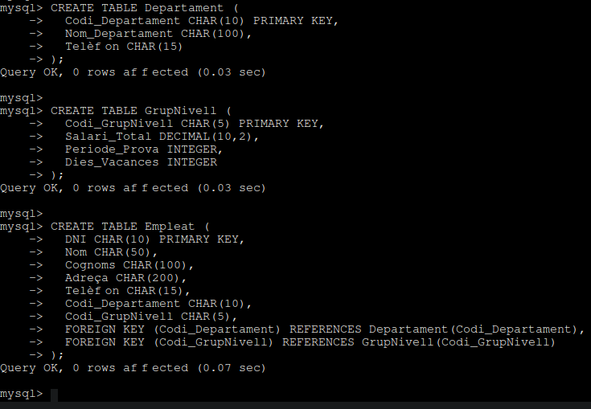
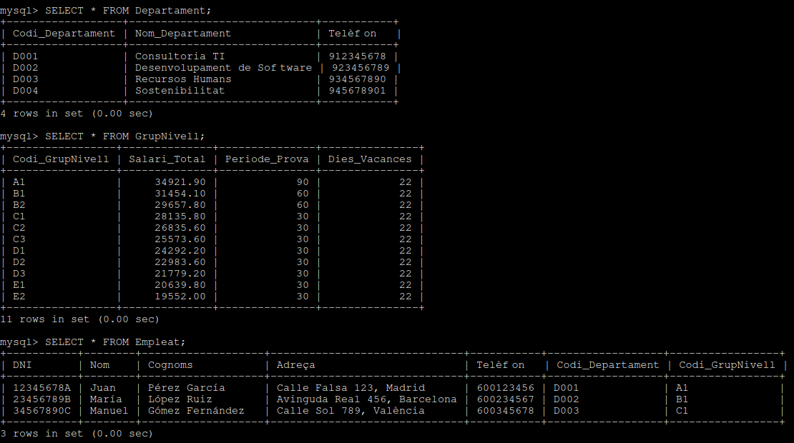
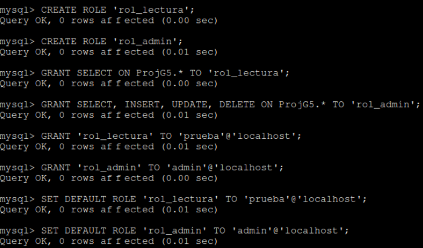
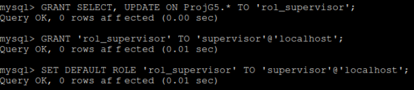
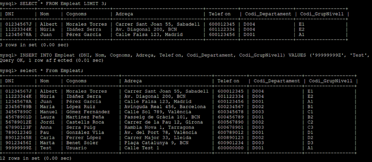

# Pro-ASIXc1D-G5
Projecte Transversal ASIXc 2024-2025

Bienvenido al manual de Documentación del Grupo 5
---
## Indice
1. [Proposta CPD](#ejercicio-1)
2. [Implantación de los servicios de Audio y Video](#ejercicio-2)
3. [Diseño e implementación de una Base de Datos](#ejercicio-3)
4. [Sostenibilidad](#ejercicio-4)

---
<!-- Ejercicio 1 -->
# Ejercicio 1
## Propuesta de CPD

En este apartado hemos diseñado una propuesta completa de Centro de Procesamiento de Datos (CPD), tanto físico como en la nube, cumpliendo con criterios de seguridad, eficiencia, sostenibilidad y escalabilidad que se piden en el proyecto.

### Infraestructura física

- **Ubicación**: CPD situado en el interior del edificio, sin ventanas ni señalización externa, con acceso restringido y muros ignífugos.
- **Climatización**: Aire acondicionado redundante, control de temperatura (18-27 °C) y humedad (40-60 %), con filtrado HEPA y monitorización en tiempo real.
- **Cableado y distribución**: Uso de suelo y techo técnico para la canalización de cables y la refrigeración. Separación de cableado eléctrico y de datos.
- **Racks**: Dos racks de 42U con pasillos frío/calor. Cada rack incluye patch panel, switch, SAI y servidores específicos (web, audio, vídeo, BBDD).

### Infraestructura IT

- **Servidores**: 3 Dell PowerEdge R650xs (Intel Xeon, 64GB RAM, 2×1TB SSD en RAID1).
- **Switches**: 2 Cisco Catalyst 9300 con uplinks de 10Gb y redundancia.
- **Patch panels**: Uno por rack para redes interna y externa.

### Infraestructura eléctrica

- **Alimentación redundante**: Doble línea eléctrica + generador de emergencia con arranque automático.
- **SAIs**: 2 UPS APC Smart-UPS X 3000VA (30 min de autonomía por rack).

### Seguridad

- **Física**: Acceso por NFC y PIN, videovigilancia 24/7, sensores ambientales, sistema FM-200 y rutas de evacuación señalizadas.
- **Lógica**: Acceso por claves SSH, firewalls (pfSense, UFW, AWS SG), backups locales y en la nube, monitorización con Zabbix y Netdata, uso de RAID 1 y 5.

### Prevención de riesgos laborales

- Extintores CO₂, señalización, EPI, zonas sin obstáculos y acceso seguro.

### Sostenibilidad

- **Optimización energética**: Apagado automático en horas valle, hardware eficiente.
- **Energía verde**: Contrato con proveedor de energía renovable y uso de regiones AWS sostenibles (ej. Irlanda).
- **Diseño eficiente**: Rack centralizado, cableado optimizado y ventilación natural pasiva.

### Implementación en la nube (AWS)

- **Servicios utilizados**:
  - EC2 (instancias para web, audio, vídeo)
  - S3 (almacenamiento y backups)
  - RDS (bases de datos)
  - CloudWatch (monitorización)
  - Elastic Load Balancer
  - Route 53 (DNS)

### Comparativa de proveedores cloud

| Proveedor     | Energía verde | Emisiones por región | Herramientas de sostenibilidad              |
|---------------|---------------|-----------------------|--------------------------------------------|
| AWS           | Alta (≥80%)   | Sí                    | Carbon Footprint Tool                      |
| Azure         | Alta (≥60%)   | Sí                    | Sustainability Calculator                  |
| Google Cloud  | Excelente (100%) | Sí                  | Carbon-Free Energy Score                  |

**Conclusión**: Vemos que AWS ofrece la mejor integración y servicios para empresas como InnovateTech.

---
<!-- Ejercicio 2 -->
# Ejercicio 2
## Implantación de los servicios de Audio y Video

**- Implantación de un servidor de Audio:** Hemos instalado un servidor de audio que nos permite gestionar transmisiones en tiempo real para nuestros clientes y usuarios. La infraestructura debe ser capaz de soportar el volumen de tráfico generado por este tipo de servicio, sin comprometer la calidad del contenido. Además, hemos realizado diversas comprobaciones para asegurarnos de que nuestra red pueda gestionar de manera eficiente este tráfico.

**- Implantación de un servidor de Streaming Video:** Otro de los servicios es el streaming de video. Hemos solicitado la implementación de un servidor que permita una distribución fluida y de calidad de nuestro contenido audiovisual. Al mismo tiempo, hemos hecho diversas pruebas para evitar saturaciones en la red y garantizar una experiencia de usuario óptima, maximizando el uso responsable de los recursos disponibles.

**- Comprobaciones de Ancho de banda:** Las comprobaciones de ancho de banda serán una prioridad para asegurarnos de que el sistema diseñado pueda gestionar adecuadamente los flujos simultáneos de audio y video sin pérdidas de calidad ni colapsos en la red. Queremos una solución que optimice el uso de la infraestructura existente y minimice el impacto ambiental de los servicios que ofrecemos.

---
<!-- Ejercicio 3 -->
# Ejercicio 3
## Diseño e implementación de una Base de Datos

En esta parte del proyecto hemos diseñado y creado una base de datos orientada a la gestión de clientes, cumpliendo con los requisitos establecidos.

### Modelo Entidad-Relación

Como punto de partida, elaboramos el **modelo Entidad-Relación** a partir de las entidades:

- Empleados  
- Niveles de Grupo  
- Departamentos  

En cada entidad hemos definido su *clave primaria*, los *atributos* necesarios y las *relaciones* correspondientes entre ellas.

### Transformación a modelo relacional

A continuación, realizamos la **transformación del modelo Entidad-Relación al modelo relacional**, como paso previo a su implementación en un sistema gestor de bases de datos. Esta transformación permitió definir las tablas, claves primarias y foráneas, así como los tipos de datos apropiados.

Con la estructura definida y los datos necesarios disponibles (por ejemplo, los convenios correspondientes), procedimos a la **implementación en el gestor de bases de datos MySQL**.

### Implementación de los datos en MySQL 

Para hacer la implementación de los datos se instaló MySQL Server en una máquina Ubuntu 24.04 utilizando _sudo apt install mysql-server_ y se accedió al cliente de MySQL con _sudo mysql_.

Seguidamente, hemos creado la base de datos con el nombre de _ProjG5_ usando el comando _CREATE DATABASE ProjG5;_ y la hemos seleccionado para trabajar con ella con _USE ProjG5;_.

Una vez dentro de esta base de datos se creó las tres tablas necesarias: _Departament_, _GrupNivell_ y _Empleat_. Cada tabla se diseñó con sus respectivas claves primarias y relaciones necesarias mediante claves foráneas.

Posteriormente, se insertaron los datos en cada tabla utilizando sentencias _INSERT INTO_, asegurando que los valores correspondieran con las relaciones establecidas entre las entidades.

Después, hemos verificado la creación de las tablas y la inserción de los datos utilizando los comandos _SHOW TABLES;_ para ver las tablas creadas y _SELECT * FROM nombre_tabla;_ para visualizar los datos insertados en cada una de las tablas que hemos creado.

Para finalizar, hemos creado 3 diferentes usuarios para la base de datos y les hemos asignado distintos roles con permisos diferentes.

- El usuario *Prueba* simplemente podia visualizar las tablas con el comando _SELECT * FROM nombre_tabla;_
- Otro usuario era el *Admin*, este usuario tenia acceso total a las tablas de la base de datos, sin ninguna limitación o restricción.
- Por ultimo teniamos al usuario *Supervisior*, este usuario solamente tenia acceso a visualizar las tablas y a actualizarlas.

Cada uno de estos usuarios tenia acceso a la base de datos con su propia contraseña.

### Pruebas de usos de Usuarios / Permisos

Por último, hicimos diferentes comprobaciones de sentencias (*Insert, Select, Update...*) para poner a prueba las restricciones de los roles de cada usuario creado.

En esta imagen vemos que el usuario *Prueba* puede consultar las tablas pero no tienen permiso para insertar nuevos datos.

El usuario *Admin* podemos ver que no tiene ningún tipo de restricción y puede visualizar e insertar datos en las tablas sin problema.

Y por otra parte el usuario *supervisor* puede ver las tablas y actualizarlas, pero no es capaz de insertar nuevos datos en ellas.

---
<!-- Ejercicio 4 -->
# Ejercicio 4
## Sostenibilidad

Hemos seguido con los Objetivos de Desarrollo Sostenible (ODS) y los valores del Institut Tecnològic de Barcelona para desarrollar un proyecto con enfoque sostenible y eficiente.

Con ello en mente, hemos ideado las siguientes medidas:

### Acciones sostenibles implementadas
- Uso de proveedores cloud con energía renovable.
- Virtualización y consolidación de servicios para reducir el número de máquinas.
- Monitorización del rendimiento para evitar consumos innecesarios.
- Elección de regiones cloud con menor huella de carbono.

### Estimación de impacto ambiental
- Consumo energético anual estimado: ~2.400 kWh
- Emisiones estimadas de CO₂: ~960 kg CO₂/año  
  (Reducible usando regiones cloud con energía 100% renovable)

### Medidas adicionales
- Apagado automático de servicios fuera del horario laboral.
- Uso de instancias cloud con eficiencia energética certificada.
- Implementación de autoscaling para optimizar recursos.
- Promoción de buenas prácticas TIC sostenibles entre los usuarios.

