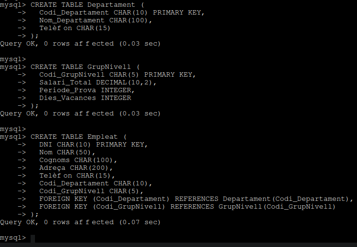
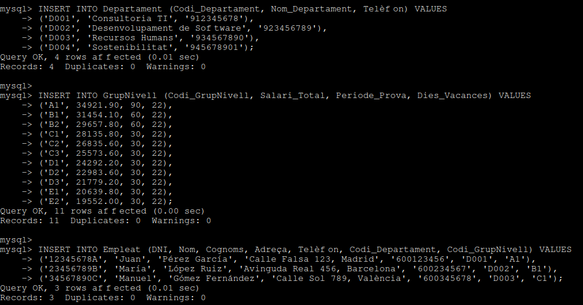
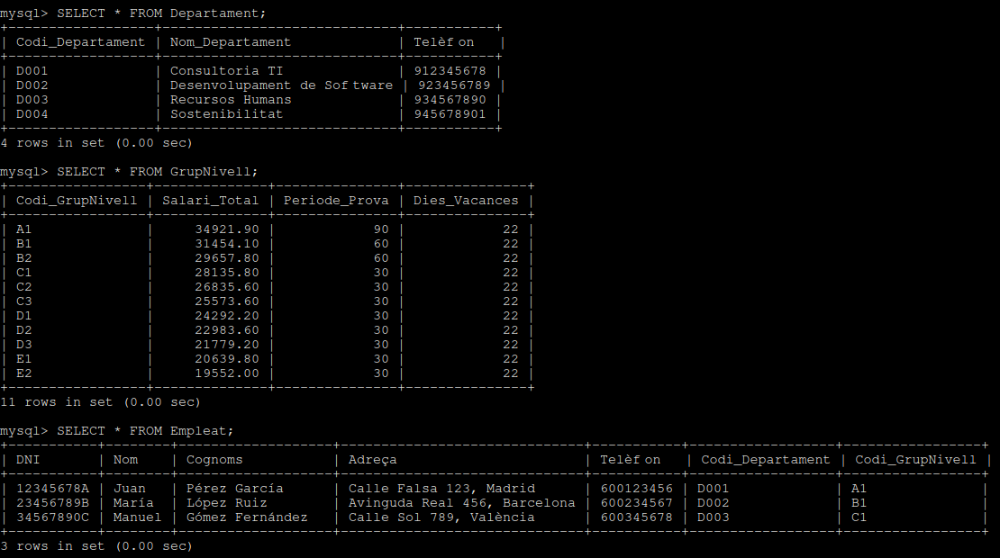
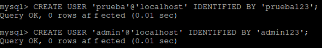
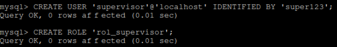
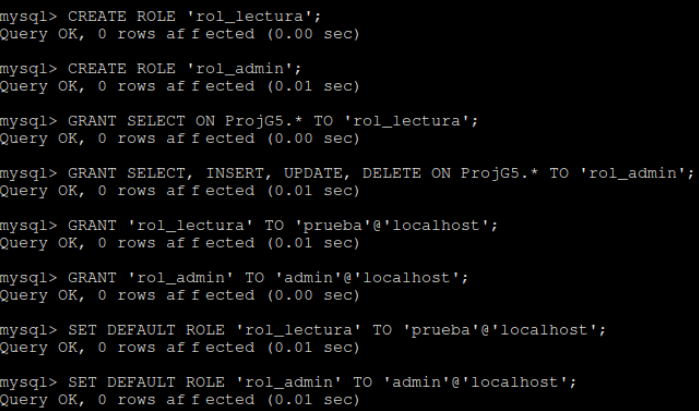
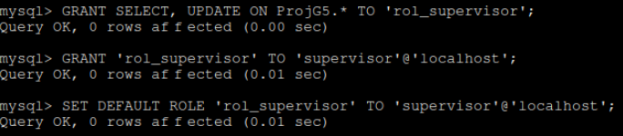
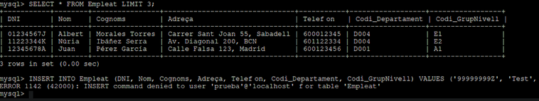
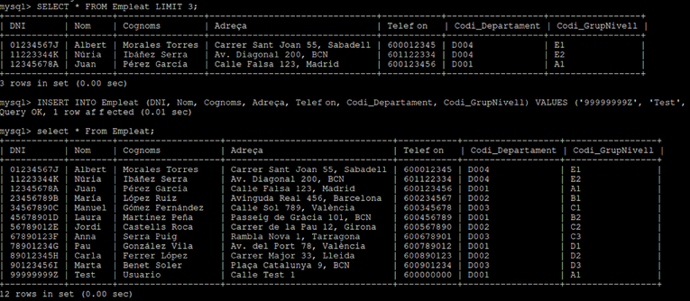
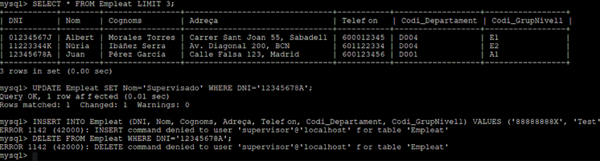

# 🗄️ Base de dades

Aquest apartat descriu el disseny i implementació de la base de dades

En aquesta part del projecte hem dissenyat i creat una base de dades orientada a la gestió de clients, complint amb els requisits establerts.

### 🧩 Modelo Entidad-Relación

Per començar, hem elaborat el **model Entitat-Relació** a partir de les entitats:

- 👨‍💼 Empleats  
- 🧑‍🤝‍🧑 Nivells de Grup  
- 🏢 Departaments  

En cada entitat hem definit la seva *clau primària*, *els atributs* necessaris i *les relacions* corresponents entre elles.

### 🔄 Transformació a modelo relacional

A continuació, realitzem la **transformació del model Entitat-Relació al model relacional**, com a pas previ a la seva implementació en un sistema gestor de bases de dades. Aquesta transformació va permetre definir les taules, claus primàries i foranes, així com els tipus de dades apropiades.

Amb l'estructura definida i les dades necessàries disponibles (per exemple, els convenis corresponents), vam procedir a la **implementació en el gestor de bases de dades MySQL**.

### 🛠️ Implementació de les dades en MySQL 

Per a fer la implementació de les dades es va instal·lar MySQL Server en una màquina Ubuntu 24.04 utilitzant _sudo apt install mysql-server_ i es va accedir al client de MySQL amb _suo mysql_.

Seguidament, hem creat la base de dades amb el nom de _ProjG5_ fent servir la comanda _CREATE DATABASE ProjG5;_ i l'hem seleccionat per a treballar amb ella amb _USE ProjG5;_.

Una vegada dins d'aquesta base de dades es va crear les tres taules necessàries: _Departament_, _GrupNivell_ i _Empleat_. Cada taula es va dissenyar amb les seves respectives claus primàries i relacions necessàries mitjançant claus foranes.

Posteriorment, es van inserir les dades en cada taula utilitzant sentències _INSERT INTO_, assegurant que els valors corresponguessin amb les relacions establertes entre les entitats.

Després, hem verificat la creació de les taules i la inserció de les dades utilitzant els comandos _SHOW TABLES;_ per a veure les taules creades i _SELECT * FROM nom_taula;_ per a visualitzar les dades inserides en cadascuna de les taules que hem creat.

Per finalitzar, hem creat 3 usuaris diferents per a la base de dades i els hem assignat diferents rols amb permisos diferents.

- L'usuari *Prova* simplement podia visualitzar les taules amb la comanda _SELECT * FROM nom_taula;_

- Un altre usuari era el *Admin*, aquest usuari tenia accés total a les taules de la base de dades, sense cap limitació o restricció.

- Finalment teníem a l'usuari *Supervisor*, aquest usuari solament tènia accés per visualitzar les taules i a actualitzar-les.

Cadascun d'aquests usuaris tenia accés a la base de dades amb la seva pròpia contrasenya.

### 🧪 Proves d'usos d'Usuaris / Permisos

Finalment, vam fer diferents comprovacions de sentències (*Insert, Select, Update...*) per a posar a prova les restriccions dels rols de cada usuari creat.

En aquesta imatge veiem que l'usuari *Prova* pot consultar les taules, però no tenen permís per a inserir noves dades.

L'usuari *Admin* podem veure que no té cap tipus de restricció i pot visualitzar i inserir dades en les taules sense problema.

I, d'altra banda, l'usuari *Supervisor* pot veure les taules i actualitzar-les, però no és capaç d'inserir ni eliminar dades en elles.

