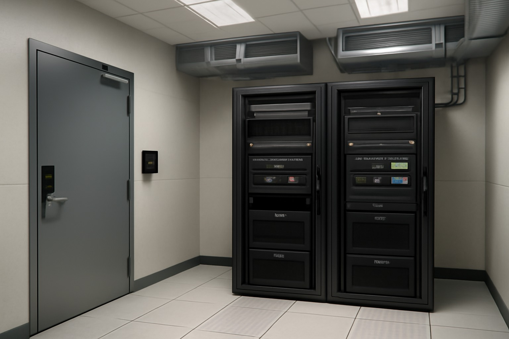
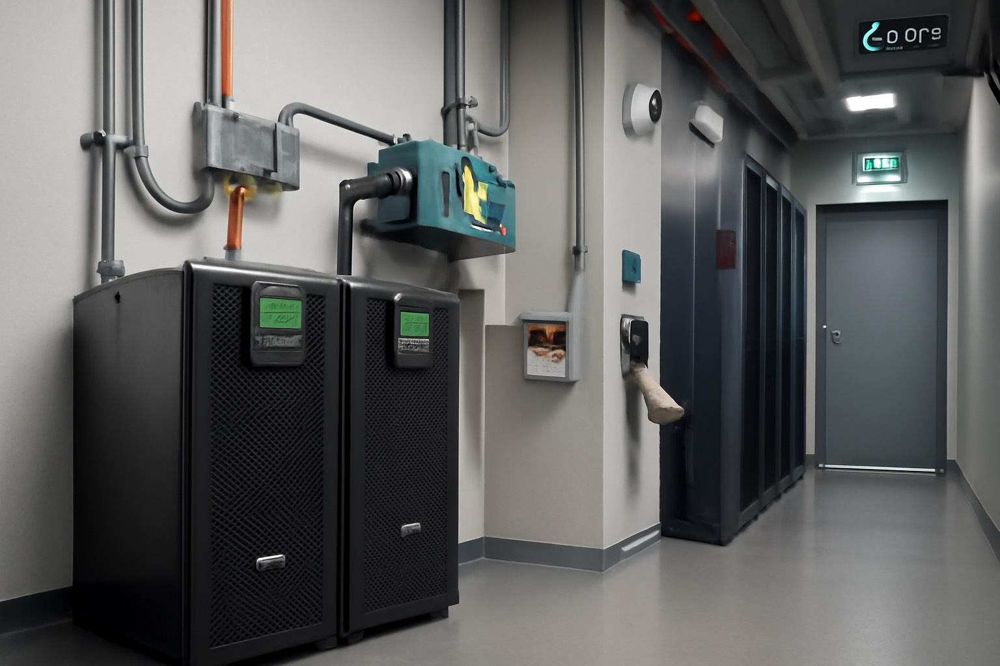

# Infraestructura CPD

Aquest apartat descriu la ubicació física, sistemes de climatització, racks i seguretat del CPD.

# 🏢 Proposta de CPD – Projecte Transversal ASIXc

## 1️⃣ Ubicació física

### 📍 Situació de la sala
El CPD s’ubica a una zona interior de l’edifici, sense finestres ni façana externa, amb accés restringit per targeta NFC i reforçat per PIN o biometria. Es recomanen parets ignífugues per a la seguretat passiva.

### 🌬️ Climatització
- Sistemes redundants d’aire condicionat.
- Temperatura controlada entre **18–27 °C**.
- Humitat relativa entre **40–60%**.
- Monitorització en temps real.
- Filtració de l’aire amb filtres HEPA per evitar pols i partícules.

### 🔒 Mesures d’ocultació
- Porta sense rètols identificatius.
- Nom de la sala: `Sala Tècnica 17`.
- Accés restringit i integrat amb sistemes de seguretat.

### 🔌 Gestió del cablejat
- Canalitzacions separades per senyal i potència.
- Pas de cables per **terra tècnic** i **sostre tècnic**.
- Tots els cables etiquetats i organitzats per trams.

### 🧱 Terra i sostre tècnic
- Terra elevat de 30 cm.
- Sostre tècnic amb sensors d’incendis i ventilació.
- Materials ignífugs i resistents.

### 🗂️ Estructuració dels racks

**Rack 1**
- Patch Panel 1
- Switch 1
- Servidor Web i Àudio
- SAI 1

**Rack 2**
- Patch Panel 2
- Switch 2
- Servidor Vídeo i Base de Dades
- SAI 2

---

## 2️⃣ Infraestructura IT

### 🖥️ Servidors
3 servidors físics tipus rack:
- **Model:** Dell PowerEdge R650xs
- **CPU:** Intel Xeon
- **RAM:** 64 GB
- **Disc:** 2x SSD 1TB (RAID 1)

### 🔌 Patch panels
- 2 unitats, un per cada rack (xarxa interna i externa).
- Faciliten la distribució i manteniment.

### 🌐 Switches
- 2 Cisco Catalyst 9300 gestionables.
- Uplinks de 10Gb per alta capacitat.
- VLANs: dades, administració, backups, streaming.

### 📊 Diagrama de racks

---

## 3️⃣ Infraestructura elèctrica

### ⚡ Alimentació redundant
- Dues línies independents: xarxa pública i grup electrogen.
- Sistema de canvi automàtic entre fonts.

### 🔋 SAIs
- 2 APC Smart-UPS X 3000VA.
- Càrrega per rack: 1000W.
- Autonomia: 30 minuts.
- Alarmes per sobretemperatura i fallada elèctrica.

### ⚡ Infraestructura elèctrica del CPD

---

## 4️⃣ Seguretat

### 🔐 Física
- Control d’accés amb targeta NFC.
- Videovigilància 24/7 amb 4 càmeres IP.
- Gravació de seguretat durant 30 dies.
- Sensors ambientals (fum, calor, moviment).
- Sistema d’extinció amb gas FM-200.
- Vies d’evacuació senyalitzades i il·luminades.

### 🧑‍💻 Lògica
- Accés via SSH amb claus públiques.
- Rols d’usuari definits.
- Firewalls: pfSense + UFW + AWS Security Groups.
- Monitoratge: Zabbix i Netdata.
- Còpies de seguretat: local i AWS S3/Glacier.
- Sistemes RAID 1 i RAID 5 segons funció.

### ⚠️ Prevenció de riscos laborals
- Zones lliures d’obstacles.
- Extintors CO₂ disponibles.
- Cartelleria de seguretat.
- Ús d’EPI per al manteniment.

---

## 5️⃣ Sostenibilitat

### ♻️ 5.1 Optimització d'energia
- Apagat automatitzat en hores vall.
- Maquinari de baix consum energètic.

### 🌱 5.2 Energia verda
- Contracte amb proveïdor verd.
- Triada regió AWS amb energia 100% renovable (Irlanda).

### 🔌 5.3 Estalvi en cablejat
- CPD ubicat al centre de l’edifici.
- Planificació eficient entre racks per reduir longituds.

### 💨 5.4 Circulació d’aire natural
- Sistemes de ventilació passiva nocturna cap a zones fredes.

---

## ☁️ 6️⃣ Implementació al núvol AWS

### Serveis AWS utilitzats:
| Servei        | Funció principal                      |
|---------------|----------------------------------------|
| EC2           | Servidors web, àudio i vídeo          |
| S3            | Backups i arxius multimèdia           |
| RDS           | Base de dades relacional              |
| CloudWatch    | Monitoratge i alertes                 |
| Elastic LB    | Equilibri de càrrega                  |
| Route 53      | Gestió de DNS global                  |

---

## 📊 7️⃣ Comparativa de proveïdors Cloud

| Proveïdor       | Energia verda     | Emissions per regió | Eines de sostenibilitat                    |
|------------------|--------------------|----------------------|--------------------------------------------|
| **AWS**          | Alta (≥80%)         | Sí                   | AWS Carbon Footprint Tool                 |
| **Azure**        | Alta (≥60%)         | Sí                   | Microsoft Sustainability Calculator       |
| **Google Cloud** | Excel·lent (100%)   | Sí                   | Carbon-Free Energy Score                  |

### ✅ Conclusió
**AWS** és l’opció més equilibrada per InnovateTech: bona sostenibilitat, serveis integrats i suport empresarial sòlid.

---

📌 *Autor: Grup 5 ASIXc | Curs 2024–2025*  
📁 *Document publicat al GitHub oficial del projecte*
