# 🛠️ Guía para Transmitir Audio/Video con Darkice e Icecast

---

## 1️⃣ Actualizar el sistema  
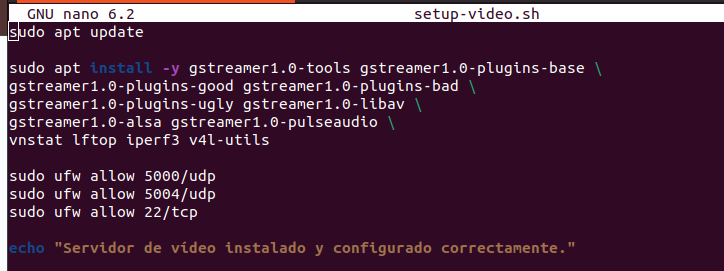


```bash
sudo apt update
```

---

## 2️⃣ Instalar Alsa-utils
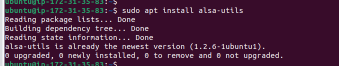

```bash
sudo apt install alsa-utils
```

---

## 3️⃣ Instalar Darkice  
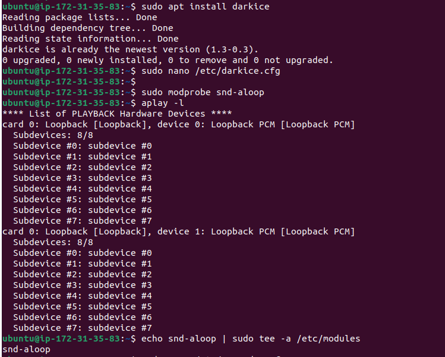

```bash
sudo apt install darkice
```

---

## 4️⃣ Configurar Darkice  
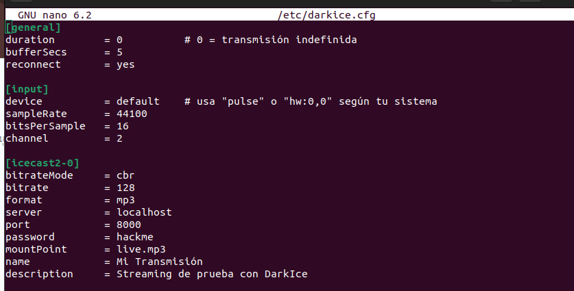

📝 Editar el archivo de configuración:

```bash
sudo nano /etc/darkice.cfg
```

🔧 Asegúrate de configurar correctamente:  
- Fuente de audio  
- Servidor Icecast  
- Códec y bitrate

---

## 5️⃣ Configurar Icecast  
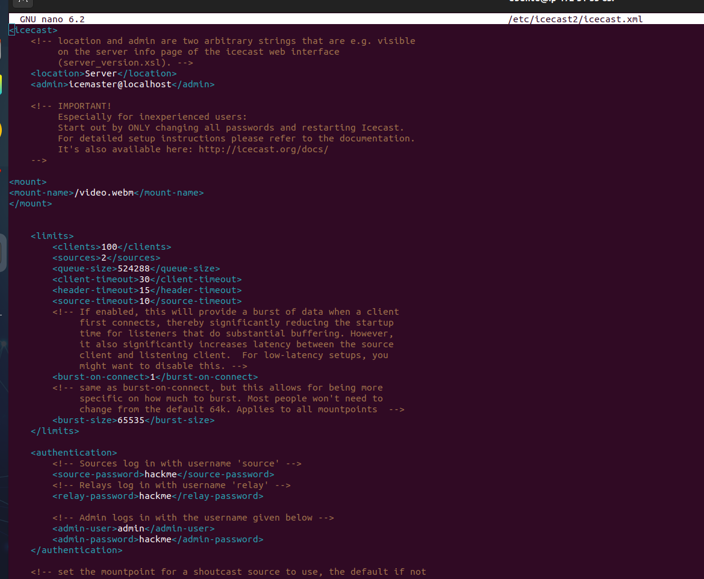

📝 Edita:

```bash
sudo nano /etc/icecast2/icecast.xml
```

⚙️ Configura:  
- Puerto de escucha  
- Mountpoint  
- Credenciales de acceso

---

## 6️⃣ Probar entrada de audio con GStreamer  
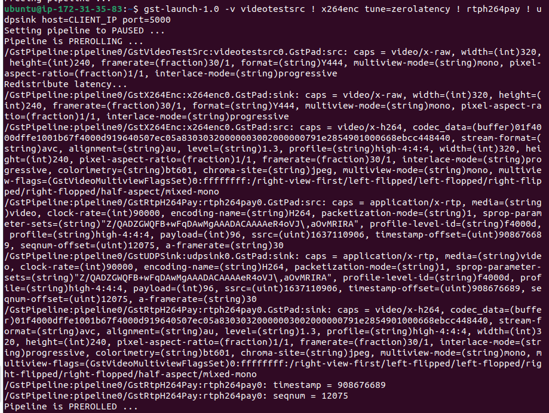

```bash
gst-launch-1.0 ...
```

🎧 Asegúrate de que el audio esté siendo capturado correctamente.

---

## 7️⃣ Pruebas de transmisión  
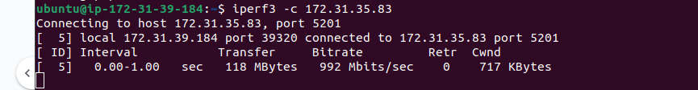

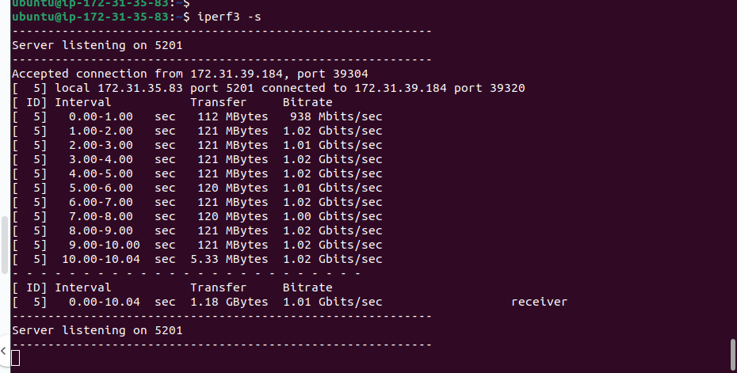

🔍 Verifica que el flujo se transmite correctamente al servidor.

---

## 8️⃣ Ejecutar Darkice  
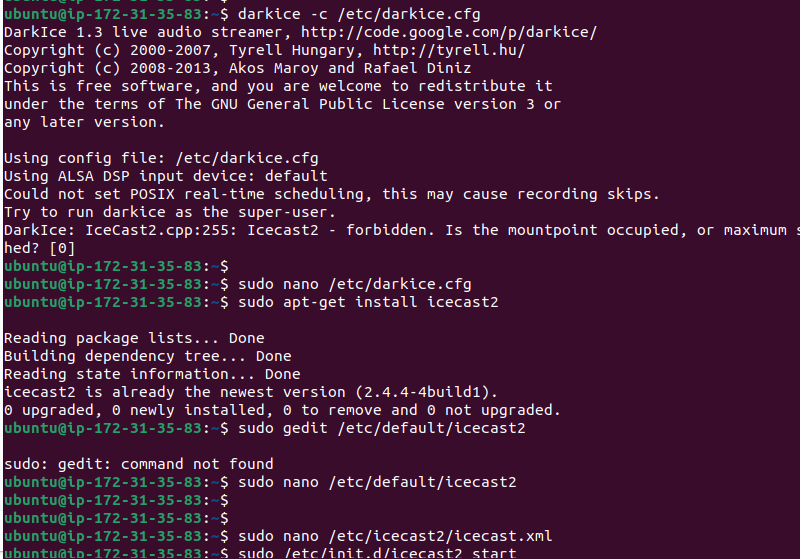

```bash
sudo darkice
```

## 9️⃣ Reproducir archivos de prueba  
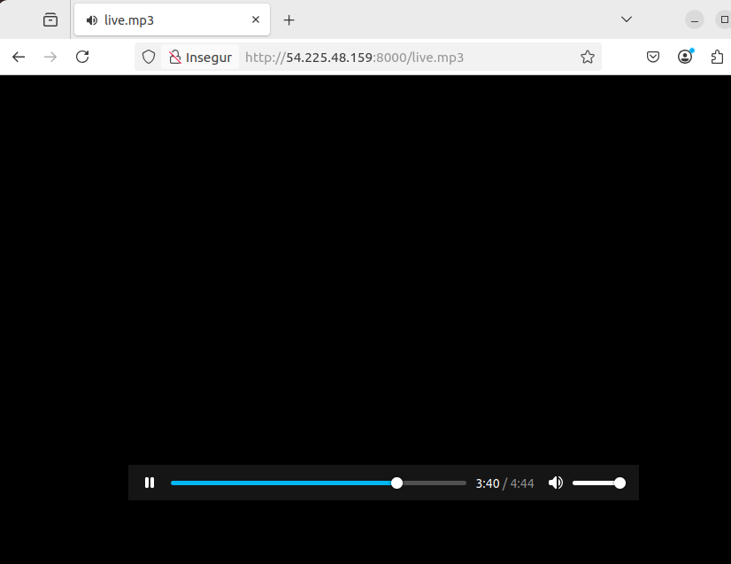

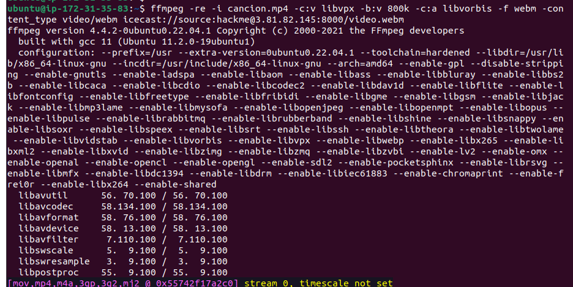

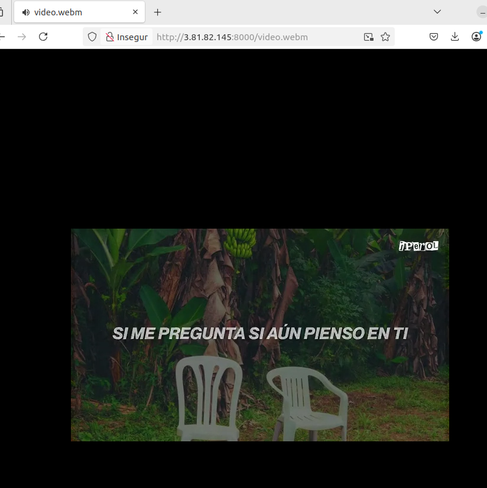

---


